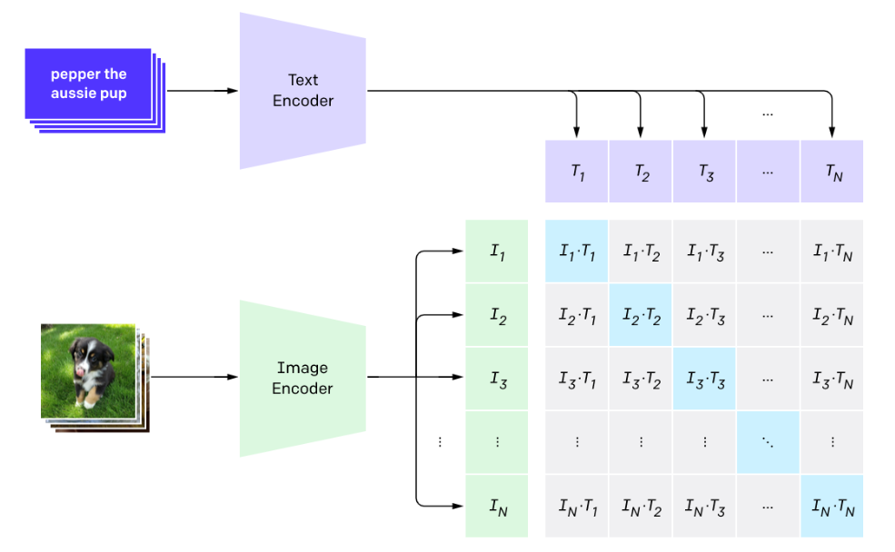

# Contrastive Language-Image Pre-training (CLIP)

CLIP (Contrastive Language-Image Pre-training) is a method created by OpenAI for training models capable of aligning image and text representations. Images and text are drastically different modalities, but CLIP manages to map both to a shared space, allowing for all kinds of neat tricks.

  
   
  
CLIP diagram

During training, CLIP takes in image-caption pairs. The images are fed through an image encoder model (based on a resnet or ViT backbone) and transformed into an embedding vector (I in the diagram above). A second model (typically a transformer model of some sort) takes the text and transforms it into an embedding vector (T in the diagram).

Crucially, both these embeddings are the same shape, allowing for direct comparison. Given a batch of image-caption pairs, CLIP tries to maximize the similarity of image and text embeddings that go together (the blue diagonal in the diagram) while minimizing the similarity between non-related pairs.
